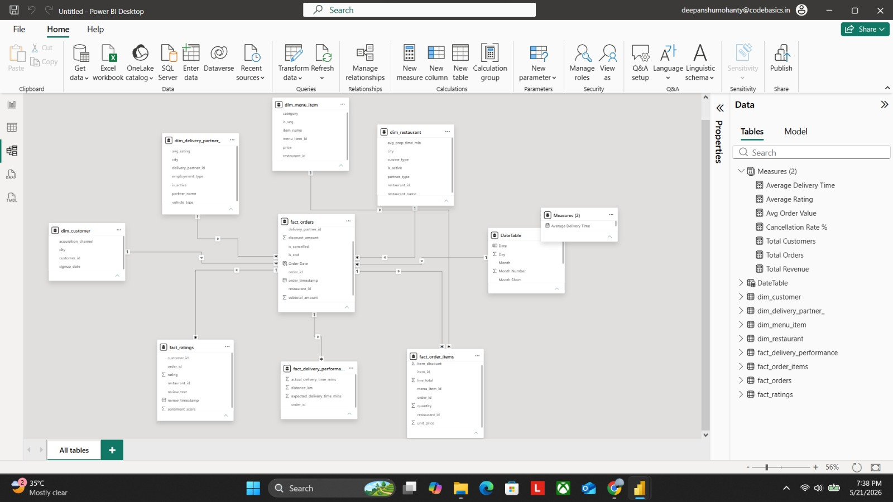
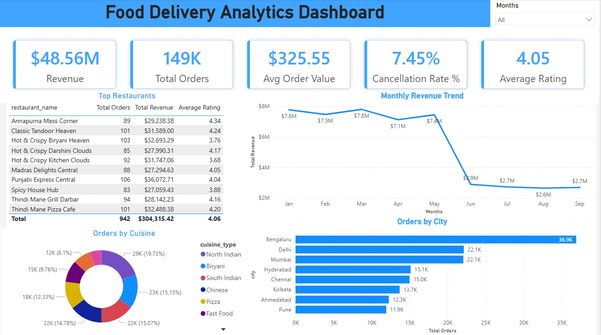

# Food Delivery Analytics Dashboard

## Project Overview
Developed an interactive Food Delivery Analytics Dashboard in Power BI to analyze revenue, customer behavior, restaurant performance, delivery operations, and cuisine trends.

## Features
- KPI Cards for Revenue, Orders, Customers, Ratings
- Monthly Revenue Trend Analysis
- Top 10 Restaurants Analysis
- Orders by Cuisine
- City-wise Order Distribution
- Cancellation Rate Tracking
- Interactive Date Slicer

## Tools & Technologies
- Power BI
- DAX
- Data Modeling
- Power Query
- Star Schema Design

## Data Model

## Dashboard Preview

## Key Insights
- Identified top-performing restaurants
- Analyzed cuisine popularity trends
- Compared city-wise order distribution
- Tracked revenue growth patterns
- Monitored cancellation behavior

## Skills Demonstrated
- Data Cleaning
- Data Modeling
- DAX Measures
- Dashboard Design
- Business Intelligence
- Data Visualization
